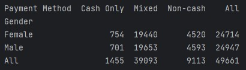
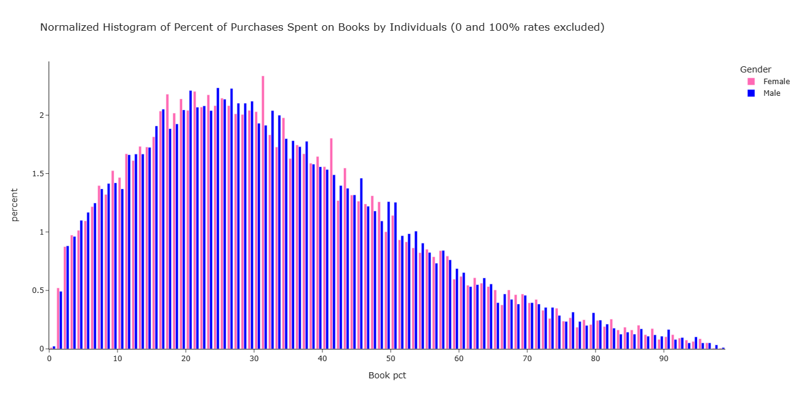

This is an example of data analysis on a synthetic dataset from Kaggle using Python and the Python libraries Pandas, Scipy Stats, and Plotly Express.  Tableau was also used to create a dashboard for the data, but no Tableau output nor results are shown here.  The Python code contains a large number of print statements which make additional comments and analyses on the data.  One of the goals of this “project” was to not repeat the analysis of the other commentors published on Kaggle website at the link below.

The link for the source data is: 
https://www.kaggle.com/datasets/shriyashjagtap/e-commerce-customer-for-behavior-analysis/

The link for the Tableau dashboard example is: https://public.tableau.com/app/profile/david.rotolo/viz/ExampleDashboardfromE-commerceCustomerDataPsuedodata/ReturnCatandGenderSales 

The source data is a csv file containing 250,000 rows (henceforth called records). An example of the data showing all the columns (henceforth called fields) is here:

The data are a simulation of purchases at an e-commerce vendor of products of 4 different categories and contains various fields which would be relevant to such a vendor.  The Python code confirms that a unique value of “Customer ID” and “Purchase Date” correspond to exactly one record and therefore comprise a “key” for the data.  It is also noted that all the data of a particular individual are acquired by grouping the data by “Customer ID.” For each individual person, the Python code generates metrics that would correspond to the individual: The method of payment (whether cash-only, noncash-only or a mix of cash and noncash), the percentage of total money spent (over all the purchases of the customer) in each category, and the percentage of purchases that had returns.  The code then statistically tests whether these rates are independent of gender.  Whether the churn rate of the customers depends on gender is also tested.  Finally, because a cumulative distribution of the age versus gender of the individuals in the dataset was done on the dashboard in Tableau, the Python program also creates the same data as a demonstration.  Python produces the same results as expected.

Below are some of the conclusions and outputs of the Python program:

 Are the payment methods and churn rate independent of gender? 

A contingency table for the payment method with the margin totals is shown below:

A chi-square test is done and the result is the chi-square statistic is 2.58 with a p-value of 0.27.  Therefore, we do not reject the hypothesis that, when given the choice of PayPal, Credit Card, and Cash, the customer propensity for using only cash, only non-cash, or a mixture of both does not depend on gender.  Similarly, for churning, we obtain a chi-square value of 0.035 corresponding to a p-value of 0.85 and do not reject the hypothesis that churn rate is independent of gender.

  Do the quantitative rates depend on gender? 

First, we quickly check the data by looking at the histograms of the percentage of money spent on each category.  All these rates are shown together (each a rate different color bar) but separately for male and female.  This was done by using the convenient pandas DataFrame function hist:

The histograms just shown and percentile data that the code produces show what it is convenient to consider 3 cases: The two categories of 0% and 100%, which have significant probabilities, probably especially for small orders and a third category of all other values.  We also see that the distributions seem similar not only with respect to gender, but the distribution of a given product category looks similar to that of any other category. 

The code calculated the probability of 0% and 100% values for each of the 4 product categories for each gender. It was found that the rates are similar to each other with respect to gender.  The same observation also held for the return rate.

Next, we look more closely at the histograms of all the qualitative data including the return rate with respect to gender.  The Plotly Express histogram function makes it easy to plot these histograms of the data that were filtered of their 0% and 100% values versus gender.  Some customization features that are offered in the histogram function and use of a for loop makes it easy to plot all the rates.  Three examples are shown below: the percent of purchases (cost) spent on books, the return rate, and the return rate including the 0% and 100% data.

The books histogram is representative of the clothes, home goods, and electronics categories, which should not be surprising given what we have seen so far.  These filtered histograms reveal more clearly the skewness of the distributions as well as the similarity in shape between the male and female distributions.

The return rate histogram looks interesting. It appears to be a superposition of the distributions for the different number of purchases by individuals.  Let us look at the histograms of the number of purchases for all the data.

We see that between 2 and 7 purchases covers a most (roughly 80%) of the individuals in the study.  We then note the return rate histogram above with the 0% and 100% cases included.  These data can help to explain the interesting pattern in the return rates.  The raw data imply that 40.59 percent of the purchases have a return.  By making an approximation by simply adding together contributions from binomial experiments with the number of trials being 2, 3, 4, 5, 6, and 7 (the number of purchases mentioned above) with p = 0.4059, and considering that the x-axis of the histogram shown earlier is the number of successes (returns) normalized by the number trials (purchases), we would observe a very large peak at 50% and peaks at 66.67% and 33.33% and the other minor peaks around 25%, 40%, 60%, and 75% (and 100%).  We note that the pattern in the return rates histogram is consistent with those observations.  Therefore, we do not conclude that this “interesting” pattern is unusual.

We now get an idea if the rates are dependent on gender for these skewed distributions that were clipped of their 0 and 100% values by looking at the Wilcoxon Rank-Sum Test.  We note the similarity in shape between the male and female populations for a given rate category.  First, the code calculates the percentage of the data that is repeated for each category rate, from which we find that for every category except the Return Rate category, less than 0.1% of the data are duplicates.

As expected, virtually all the data of the return rates have duplicates (which can create “ties” in the rank-sums).  Thus, for the non-return-rate categories we shall accept the approximation of deleting the duplicate values of those rates. For the Return Rate, we shall use the scipy.stats.mannwhitneyu
method which corrects for ties.

These are the results (table format enhanced with Excel):

Regarding the non-return-rates, we see that the medians are very close for all categories between male and female.  We also see that the p-values are such that we do not reject the hypothesis that the male and female populations are the same for a given category.  The statistic calculated appears to be the standard normal.

If we do one sided tests, we would find that the smallest p-value occurs in the one sided test having the alternative hypothesis of the Electronics Category rate of males being less than that of the females. The p-value was 0.288.

We now look at the return rate which has many ties.   Observing the statistics, we conclude that we can not reject the hypothesis that the male population is the same as the female population.  The statistic calculated appears to be the rank-sum statistic. If one were to check the p-values of the one-sided alternative hypotheses, one would find that the minimum p-value is 0.368 which of course is also not significant.  That the medians are exactly the same is not surprising because of the virtually discrete values.

Overall, we see therefore that all the rates calculated are likely independent of gender.  This is not surprising, given the histograms shown earlier, which even show that the distributions of all the product categories look similar. This is further reflected in the similarity of the medians which all hover around 30.4%. Of course, the return rate is a different type of metric and we should not be surprised that its median of 42.85% is quite different than that of the other rates.

An interesting result that can be a candidate for future work (beyond the scope of gender) would be whether the Wilcoxon rank-sum tests indicate that the rates are also independent of category.  For a synthetic dataset such as this, such a result would not be surprising because using the same parameters for the distributions in the source code would create this effect.
